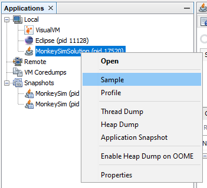
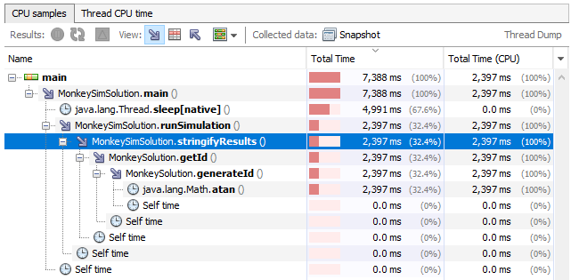

# Exercise 4 Performance Testing Exercise

For this exercise, you and a partner will profile some monkey simulation software, and improve its performance by refactoring two methods (to be determined by the results of the profiling).  This will consist of several parts:

1. Profiling (before) to determine which methods are the most CPU-intensive
1. Refactoring two methods to be more performant (from a CPU and time perspective)
1. Profiling (after) showing that your rewrite helped make your method more performant

The code is available under the src/ directory.

## MonkeySim Description

This code runs MonkeySim, which simulates a group of monkeys throwing a banana back around until it gets to the first monkey.  It accepts one argument, which states which monkey has the banana initially.

The game shall continue until the first monkey gets the banana, at which point the simulation shall end.

The monkey who has the banana shall throw it to another monkey during each round.

If a monkey is even-numbered (e.g., monkey #2, monkey #4, etc.), then the monkey with the banana shall throw the banana to the monkey equal to one-half of that initial monkey's number.  For example, monkey #4 shall throw the banana to monkey #2, and monkey #20 shall throw the banana to monkey #10.

If a monkey is odd-numbered (and not monkey #1), the monkey with the banana shall throw it to the monkey equal to three times the number of that monkey plus one `(3n + 1)`.  For example, monkey #5 shall throw the banana to monkey #16 `((3 * 5) + 1)`.

If Monkey #1 catches the banana, the system shall display the number of rounds it took for Monkey #1 to catch the banana and then the program shall exit.

At each round, the current status of who is doing the throwing and who is catching shall be displayed, along with the round number (which should start at 1).  It should use the following format: "Round 1: Threw banana from Monkey (#54 / ID 223546) to Monkey (#27 / ID 223519)"

Each monkey has an ID; this ID shall remain constant.  For instance, Monkey #5 shall always have ID 223497, and Monkey #160 shall always have ID 223652.  Any changes to the code should not modify the ID value.

Sample runs are shown in the sample_runs.txt file.

## How to Run MonkeySim

1. Running MonkeySim. For Windows do (for running MonkeySim with argument 5):
    ```
    run.bat 5
    ```
    For Mac / Linux do (for running MonkeySim with argument 5):
    ```
    ./run.sh 5
    ```
1. Running MonkeySimTest. For Windows do:
    ```
    runTest.bat
    ```
    For Mac / Linux do:
    ```
    ./runTest.sh
    ```    
    If successful, you will get a bunch randomized string concatenation tests ending with the message "ALL TESTS PASSED".

Alternatively, I've created an Eclipse project for you under the src/ directory so you can use Eclipse to import the existing project.

## What to do

In order to determine the "hot spots" of the application, you will need to run a profiler such as VisualVM (download at https://visualvm.github.io/).  Using the profiler, determine a method you can modify to measurably increase the speed of the application without modifying behavior.

Some tips for using VisualVM:
1. Your Java app will only show up in VisualVM _during_ execution.  You need to right click on the MonkeySim application and click on Sample in the context menu that shows up.  Then, on the Sampler window that shows up on the main pane, quickly click on the CPU button to start sampling CPU utilization.
  
Note that we are using the Sampler, not the Profiler.  The Sampler takes a sample of method invocations to perform measurement, so is slightly inaccurate compared to Profiler which measures all methods.  But since Sampler only measures a sample, it is much faster compared to Profiler and much less intrusive, which is suitable for our purposes.  Here is a more in-depth comparison between the two if you are interested:  
http://greyfocus.com/2016/05/visualvm-sampling/.
1. Please add the following to the list of JVM arguments: "-XX:+UseCountedLoopSafepoints -XX:-Inline".  The Sampler is only able to sample in what are called Java safepoints.  Safepoints are points in Java code where the JVM can gain control.  These arguments ensure that safepoints are present at every method call and every loop iteration, improving the accuracy of the Sampler (albeit at a slight performance penalty).  I have already added the arugments to the run.sh and run.bat scripts, but if you are running MonkeySim using an IDE, you need to add them to the run configuration.

1. If your app runs very quickly, you may not have time to perform the above actions before the app terminates!  In that case, you may want to insert a sleep() at the beginning of the main() method, during which you can perform these actions.  For example:
   ```
   try {
      Thread.sleep(10000);
   } catch (InterruptedException iex) {
   }
   ```

Now you are ready to modify that method.  Remember, the program should work EXACTLY the same as before, except it should be faster and take up less CPU time.  In order to guarantee this, you need pinning tests.  For the exercise, you will use the runs in sample_runs.txt as a systems level pinning tests.  Meaning, the output should match the original output exactly in each case (except the execution time of course).

Optimize two of the most time consuming methods in MonkeySim.  This is what I got after optimizing:  
  
I gave argument 27 for the run.  Note that now the run takes less than 3 seconds (excluding the sleep() I inserted to make attaching VisualVM easier), which is a marked improvement over 37 minutes for the original code!

## Submission

Please do a Text Submission to Courseweb with a link to the GitHub repository where you stored it, along with names of all group members.

Example:

John Doe  
Jane Doe  
https://github.com/wonsunahn/CS1632_Fall2019/tree/master/exercises/4

In the repository, beside your code, please add a screenshot of the profile you obtained after doing your optimizations and name it profile.png.  It should look similar to the screenshot above.

Please submit by Wednesday (10/30) 11:59 PM to get timely feedback.

IMPORTANT: Please keep the github private and add the following users as collaborators: nikunjgoel95, wonsunahn

## Extra Credit

This extra credit is worth 1 point out of 100 points for the entire course.

This game is a simulation of the Collatz Conjecture (https://en.wikipedia.org/wiki/Collatz_conjecture).  The conjecture states that the game will eventually end (that is the first monkey will eventually get the banana).  It is still a conjecture since nobody was able to prove it since 1937 when it was first introduced.  But on the other hand, nobody was able to disprove it since 1937 either, so it is most likely true!

However, the game does have a defect where for certain arguments, the game falls into an infinite loop (that is, the first monkey NEVER gets the banana).  Now, this defect is hard to find using just a handful of test cases you can write using JUnit.  So we are going to use stochastic testing to feed MonkeySim with a whole bunch of randomized arguments to see which triggers the infinite loop.  Modify MonkeySimTest.java to implement the testMonkeySim method which checks the invariant that no matter which argument is given, runSimulation never falls into an infinite loop.  The check can be done by catching an InfiniteLoopException thrown by runSimulation and fail()-ing that test run.  Now, runSimulation throws no exception of the kind; it just falls into an infinite loop.  You will have to modify MonkeySim to be able to detect when it is about to fall into an infinite loop and throw that exception.

In order to get the extra credit, you will have to:
1. Implement testMonkeySim using JUnit quickcheck and property-based testing.
2. Give me 3 arguments that trigger an infinite loop you discovered through the stochastic testing.

_Note: You need to have optimized MonkeySim sufficiently before even attempting this.  Or it will take forever to go through all the randomized arguments.  This may involve more drastic optimization beyond what you did for the above.

## Extra Credit Submission

The extra credit is due Monday (11/11) 11:59 PM, the same date Deliverable 4 is due.

Please do a Text Submission to Courseweb with a link to the GitHub repository where you stored it, along with names of all group members.  There is a separate Exercise 4 Extra Credit link.

Example:

John Doe  
Jane Doe  
https://github.com/wonsunahn/CS1632_Fall2019/tree/master/exercises/4

Please use the same repository as the original exercise.  That way, you won't have to reinvite us as collaborators.

In the repository, beside your code, please add the following:

1. A README.md file that lists the 3 arguments that trigger an infinite loop.
2. A runTest.txt file that is a copy-and-paste of the output of running
   ```
   time ./runTest.sh
   ```
   The output should show runSimulation being run with randomized arguments.  Some of the runs will pass, some will fail.  The time utility should show that you can complete the tests within a reasonable amount of time (< 5 minutes).


